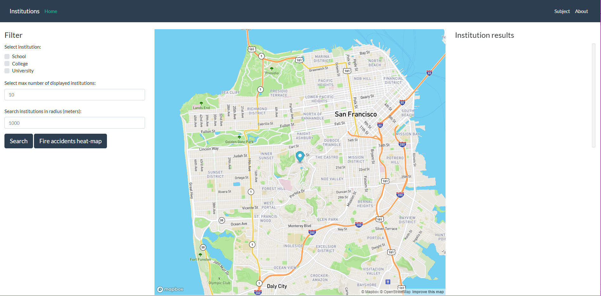
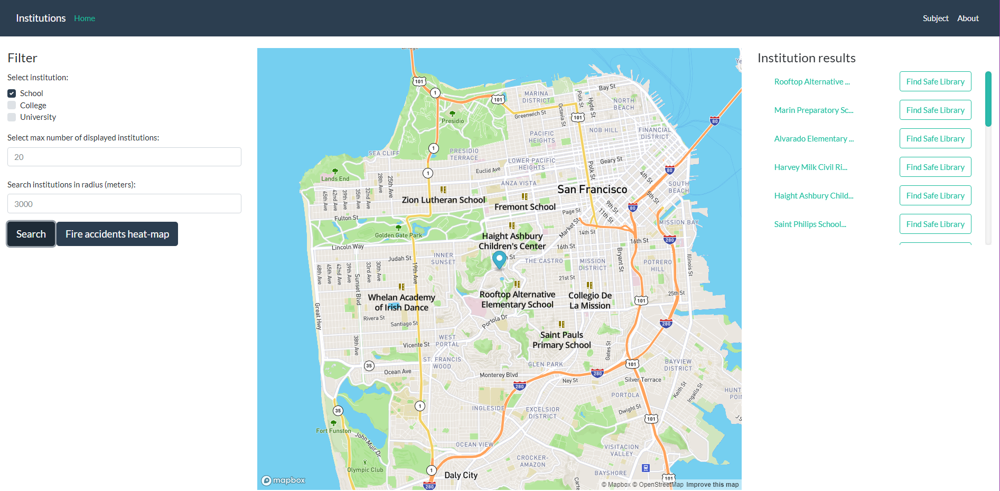
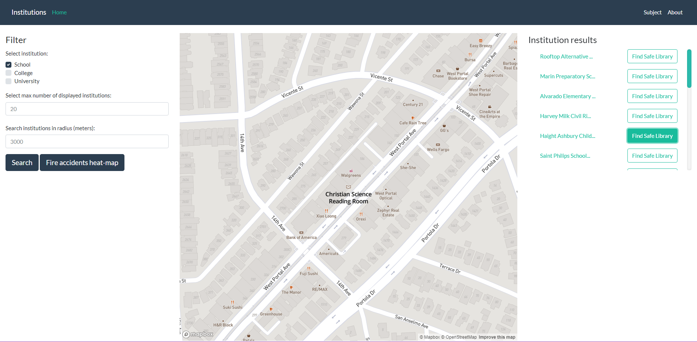
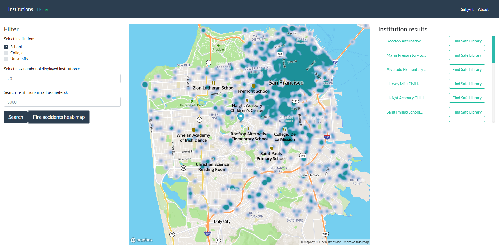

# Prehľad aplikácie

Táto aplikácia ukazuje inštitúcie typu college, school a university v San Franciscu. Najdôležitejšie príznaky aplikacie:
- vyhľadanie inštitúcií na základe blízkosti vzhľadom na súčasnú polohu
- voľba typu inštitúcie používateľom
- zoradenie a filtrovanie inštitúcií podľa vybranej vzdialenosti
- k daným inštitúciam vyhľadanie bezpečných knižníc, ktoré majú vo okruhu 500m minimum požiarných incidentov

### Ukážka funkcionality:

- Úvodná obrazovka


- Vyhľadanie inštitúcií


- Vyhľadanie bezpečnej knižnice pre zvolenú inštitúciu


- Heatmapa požiarných incidentov v San Fransiscu


Aplikácia pozostáva z 2-och samostatných celkov -- frontendový klient ako [frontendová webová aplikácia](#frontend) používajúca mapbox API (mapbox.js) a [backend-ová časť aplikácie](#backend) napísaná v [Java (Spring)](https://spring.io), zabezpečujúca komunikáciu s PostGIS-om. Klientská časť komunikuje s backendovou pomocou Ajax volaní skrz [REST API](#api).

# Frontend

Frontend aplikácia je statická HTML stránka (`src\main\resources\templates\home.html`), ktorá obsahuje mapbox.js widget. Zobrazuje inštitúcie v meste San Francisco, dovoľuje zvoliť typ inštitúcie, maximum zobrazených výsledkov a maximálnu vzdialenosť od aktuálnej pozície. Vyhľadané inštitúcie sa zobrazia v scrolliste na pravo, kde pri každej inštitúcii je možnosť vyhľadania bezpečnej knižnice. Možnosťou je aj zobrazenie heat mapy pre požiarne incidenty San Francisca.

Všetok relevantný kód k frontendu nájdeme v `src\main\resources\static\js\pdt.js`, ktorý je referovaný zo `src\main\resources\templates\home.html`.

# Backend

Backend aplikácia je implementovaná v Java Spring Web MVC a je zodpovedná za dopytovanie geo dát a formatovanie response objektu do tvaru typu geojson.

## Data

Dáta pre inštitúcie sme získali z Open Street Maps. Bola stiahnutá časť pre San Francisco a importovaná pomocou `osm2pgsql` nástroja do štandardnej OSM schémy. Požiarne incidenty boli extrahované ako externý dataset z data.sfgov.org. Jednotlivé queries môžeme nájsť v `src\main\java\sk\mste\pdtproject\util\QueryTemplates.java`. GeoJSON je generovaný použitím volania `st_asgeojson` funkcie. Úprava do požadovaného geojson formátu je však zastrešená v triede `src\main\java\sk\mste\pdtproject\factory\RSExtractorFactory.java`(vytvorenie sekvencie inštitúcie pomocou poľa JSON objektov).

## Api
V API používame request body typu JSON:
```
{
	"lon":-122.4494, 
	"lat":37.7588, 
	"maxRadius":3000, 
	"amenityTypes":["school"], 
	"maxResults":1
}
```

**Nájdi inštitúcie**

`POST /search`

**Nájdi bezpečné knižnice**

`POST /library`

**Zobraz heatmapu požiarných incidentov (bez parametrov)**

`GET /heatmap`

### Odpoveď

Volanie API vracia json odpovede obsahujúce jednotlivé koordináty pre `inštitúcie` a `knižnice`:
```
[
   {
      "type":"Feature",
      "geometry":{
         "type":"Point",
         "coordinates":[
            -122.4435823,
            37.7549302999478
         ]
      },
      "properties":{
         "title":"Rooftop Alternative Elementary School",
         "icon":"school"
      }
   }
]
```
`geojson` obsahuje vzdelavacie inštitúcie v danej oblasti.

## Optimalizácia dopytov do databázy
Pre optimalizáciu queries boli vytvorené indexy nad stĺpcami geometrie (`way`) v oboch tabuľkách (inšitúcie, požiary):
```
CREATE INDEX IF NOT EXISTS index_way ON planet_osm_point(way);
CREATE INDEX IF NOT EXISTS index_way ON fires(way);
```
